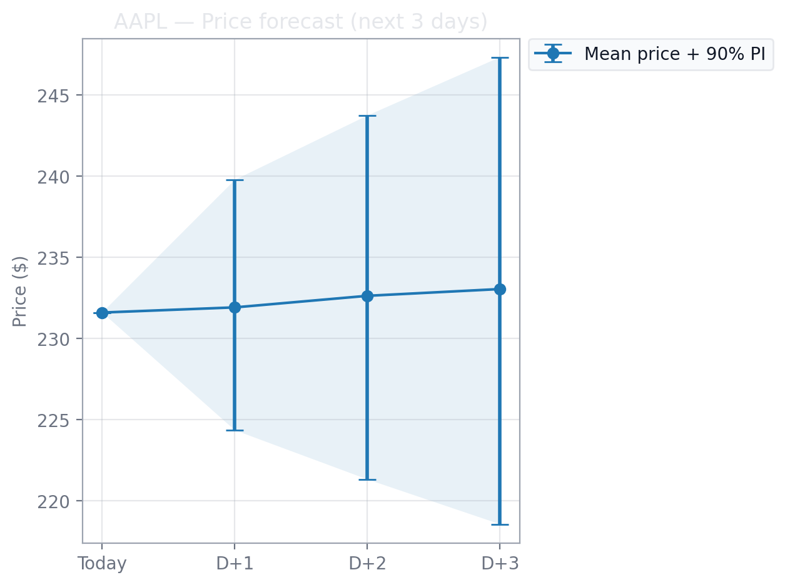

<h1 align="center">📈 Bayesian Estimation of Sentiment Impact on Stock Prices</h1>

<p align="center">
  <i>Headlines → VADER sentiment → Bayesian Student-t regression (PyMC) → next-day log-return + multi-day forecasts with uncertainty</i>
</p>

<p align="center">
  <a href="LICENSE"></a>
  
  
  
  
</p>

---

### ✍️ Authors
Shreemadhi Babu Rajendra Prasad  · Saipavan Narayanasamy   
*M.Sc. Data & Computational Science · University College Dublin*

📌 **Poster:** [Final Project Poster](./poster/final_project_poster_A0.pdf)

---

## 📑 Table of Contents
- [Overview](#overview)
- [Workflow](#workflow)
- [Demo / Screenshots](#demo--screenshots)
- [Features](#features)
- [Model](#model)
- [Install & Run](#install--run)
- [Using the App](#using-the-app)
- [Outputs & Logging](#outputs--logging)
- [Project Structure](#project-structure)
- [About](#about)
- [Limitations & Future Work](#limitations--future-work)
- [Tech Stack](#tech-stack)
- [License](#license)
- [Acknowledgments](#acknowledgments)
- [Maintainers](#maintainers)

---

## 🚀 Overview

This research app demonstrates how **daily news sentiment** can be transformed into a predictive signal for stock returns:

1. **Headlines** pulled per ticker  
2. Scored via **NLTK VADER** (compound)  
3. Aggregated into a **daily sentiment index** \(z_t\)  
4. Modeled with **Bayesian Student-t regression (PyMC)** to predict:
   - **Next-day log-return**
   - **3-day price forecasts** with **uncertainty intervals**

Outputs include **posterior summaries, HDIs, and forecast intervals**.

---


## 🖼️ Demo / Screenshots

### Forecast Examples
<p align="center">
  
  
</p>

### Comparison
<p align="center">
  
</p>

---

## 🎯 Features

- **Sentiment extraction:** Headlines → VADER → daily average signal  
- **Bayesian regression:** Student-t regression of \(r_t\) on lag-1 sentiment \(z_{t-1}\)  
- **Uncertainty quantification:**  
  - 94% HDIs for parameters  
  - 90% PIs for forecast prices  
- **Forecasting:** 3-day ahead price forecasts (table + chart)  
- **Comparison:** Effect size (β) and indexed forecast comparison across tickers  
- **Reproducibility:** Every run logged in `results/predictions_log.csv` (ignored by Git)

---

## 🧮 Model

We model **daily log-returns** with heavy tails:

$$
r_t = \alpha + \beta z_{t-1} + \varepsilon_t, 
\quad \varepsilon_t \sim \text{Student-t}(\nu, 0, \sigma)
$$

- \(r_t\): next-day log-return  
- \(z_{t-1}\): yesterday’s average sentiment  
- Parameters \((\alpha, \beta, \sigma, \nu)\) inferred with **PyMC (NUTS)**  
- **β answers:** “Does yesterday’s sentiment shift tomorrow’s return?” 
- Forecast prices simulated via log-return paths


---

## Install & Run

> [Python **3.9+** recommended](https://www.python.org/downloads/) · [Docs](https://docs.python.org/3.9/)

### 1) Create & activate a virtual environment

**Windows**
~~~bash
python -m venv venv
venv\Scripts\activate
~~~

**macOS/Linux**
~~~bash
python -m venv venv
source venv/bin/activate
~~~

### 2) Install packages
~~~bash
pip install -r requirements.txt
~~~

### 3) One-time: download VADER lexicon used by NLTK
~~~bash
python -m nltk.downloader vader_lexicon
~~~

### 4) Launch the app
~~~bash
streamlit run app/streamlit_app.py
~~~

Open the local URL shown by Streamlit (usually `http://localhost:8501`).

---

## Using the app

**Inputs**
- **Ticker A** (required) and **Ticker B** (optional)
- **Run Speed:** _Fast / Standard / Accurate_ (controls MCMC draws / tuning)

**Tabs**
- **Ticker 1 / Ticker 2:** company blurb, **Latest Headlines**, **Predicted Log-Return**, **Next Price (90% PI)**, **Today’s Sentiment**, **Posterior Summary**, **3-day Price Forecast** (table + chart).
- **Comparison:** quick table of **\(\beta\)** (mean + 94% HDI) and **Day-1 price forecast**; **indexed history vs mean forecast** dots.
- **Run log:** a banner displays whether the log CSV was **Created** or **Appended**. You can also download the log directly from the UI.

---

## Outputs & Run Log

**Figures & tables shown in the UI**
- **Predicted log-return** (mean + 94% HDI)  
- **Next price** (mean + 90% PI)  
- **Posterior summary** for \(\alpha, \beta, \sigma, \nu\) with diagnostics (**ESS**, **\(\hat{R}\)**)  
- **3-day price forecast:** `(day_ahead, price_mean, price_p05, price_p95)` + chart

**Run log CSV:** `results/predictions_log.csv` _(local; ignored by Git)_  
Contains timestamp, tickers, posterior summaries and key forecast numbers (including **day-ahead price mean** and **PI endpoints**).  
Useful for auditing, comparisons across runs, and lightweight experimentation.

---

## Project structure
```text
project/
├─ app/
│  └─ streamlit_app.py           # Streamlit UI + modeling/forecast glue
├─ poster/
│  └─ final_project_poster_A0.pdf
├─ literature/                   # (optional) add literature-review PDFs here
├─ outputs/                      # screenshots/exports (optional; .gitkeep added)
├─ results/
│  └─ predictions_log.csv        # run log (local; ignored by Git)
├─ requirements.txt
└─ README.md
├─ requirements.txt
└─ README.md
```

---

## About the project

**Goal.** Turn daily headlines into a **quantitative sentiment signal** and measure its **predictive effect** on **next-day returns**; produce **uncertainty-aware price forecasts** over short horizons.

**Why Student-t?** Heavy-tailed residuals guard against outliers and volatility clustering common in returns.

**Why Bayesian?** Full posteriors + diagnostics (ESS, $\hat{R}$) + calibrated prediction intervals.

**Why Streamlit?** A fast, transparent interface to explore data, diagnostics, and forecasts.

---

## Limitations & future work

- Predictability may be **weak/noisy**; real-world alpha is hard.  
- Headline sampling & VADER rules can bias the signal — try **domain-tuned** or **LLM** sentiment.  
- Extend to **multivariate** models (market/sector factors), **hierarchical** priors, or **state-space** models with **stochastic volatility**.  
- **Evaluation:** add rolling backtests; CRPS/quantile loss for PIs; compare with AR/ARX/GARCH baselines.  
- Scheduled data refresh, richer news sources, and caching.

> **Disclaimer:** For research/education only — not financial advice.

---

## Tech stack

**Python · Streamlit · PyMC · ArviZ · NumPy · pandas · Matplotlib · NLTK (VADER) · requests/bs4 · yfinance**

---

## License

**MIT** — see [`LICENSE`](LICENSE).

---


## Acknowledgments

- **VADER** sentiment (NLTK)  
- **PyMC / ArviZ** for Bayesian modeling & diagnostics  
- Public headline sources used by the app; Yahoo price data  
- **UCD — ACM40960 Projects in Maths Modelling**

